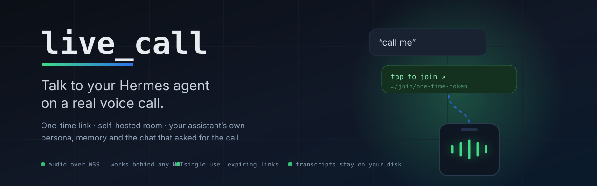

<p align="center">
  
</p>

<p align="center">
  <a href="#install"></a>
  
  
  
</p>

# live_call

**Talk to your [Hermes agent](https://github.com/NousResearch/hermes-agent) on a real voice call.**

Say "call me" in any chat. Your assistant sends back a link, you tap it, and it
starts talking — as *itself*, with its memory and the conversation you were just
having. No app, no account, no signup.

```
you:      call me
assistant: tap to join ↗  https://…/join/one-time-token
     ↓ tap
     🎙️  "Mega here. What do you need?"
```

## Why it's different

- **It's your assistant, not a demo bot.** Same persona, same memory, and it
  already knows what the chat was about — the call continues the thread.
- **Nothing to install on your phone.** The join page is a single self-contained
  HTML file served by your own machine. No CDN, no trackers, no third-party JS.
- **Works on any network.** Audio rides a WebSocket over HTTPS, so hotel Wi-Fi,
  mobile data and CGNAT all work — no STUN/TURN to operate, no NAT holes.
- **Private by default.** Media terminates on your machine. Transcripts are
  written to your disk and nowhere else.
- **Links are one-shot.** Single-use, expiring, and the room deletes itself when
  the call ends.

## What works today

| | |
|---|---|
| ✅ | Voice calls, full duplex, interrupt it mid-sentence |
| ✅ | Your assistant's own persona, memory and current conversation |
| ✅ | A markdown transcript of every call |
| 🚧 | Camera vision — the page captures video; the model isn't fed frames yet |
| 🚧 | MP4 recording |

Runs on Gemini Live by default (~US$0.02–0.03/min for voice). Any Pipecat
speech-to-speech service can be swapped in.

## Install

Needs a working Hermes install and Python 3.10+.

```bash
git clone https://github.com/marcelopaniza/hermes-live-call ~/.hermes/plugins/live_call
cd ~/.hermes/plugins/live_call
./install.sh                                   # venv, deps, optional tunnel service
```

Then add a model key to `$HERMES_HOME/.env` (never on a shell command line):

```bash
read -s K; echo "GEMINI_API_KEY=$K" >> "$HERMES_HOME/.env"; unset K
```

Enable it and restart the gateway:

```bash
hermes plugins enable live_call
systemctl --user restart hermes-gateway.service
```

Now ask your assistant to call you.

**No key yet?** It falls back to an **echo** pipeline that plays your own voice
back — the fastest way to prove audio works before adding a model.

## Reaching your phone

The room server listens on loopback only, so it needs one public entry point.
`install.sh` sets up a Cloudflare quick tunnel, which is zero-config and good
enough to try it out — but Cloudflare states quick tunnels are "for testing and
development only", and their hostname changes on every restart.

For anything regular, point `LIVE_CALL_PUBLIC_URL` at a stable URL you control —
a named tunnel or your own reverse proxy. One line of config, and links stop
moving.

## Security, in one screen

- **One-shot links.** 128-bit token, single use, expiring; the room dies with
  the call and caps itself at 30 minutes.
- **Owner-only memory.** Released only to your own chat, matched on a stable
  platform id and bound to the caller when the link is minted.
- **Nothing controllable from outside.** The stop endpoint refuses requests that
  arrive through the tunnel; health tells the public only that it's alive.
- **Local at rest.** Transcripts `0600` in a `0700` directory.

Two things to know before exposing it: **the token travels in the URL** (browser
history, tunnel logs), and **your tunnel provider terminates TLS** unless you run
your own proxy.

Full threat model, everything an adversarial review found and fixed, and the
accepted limitations: **[SECURITY.md](SECURITY.md)**.

## Advanced

Configuration reference, the agent's tools, how the persona and context are
assembled, swapping the model, the component map, and why the audio doesn't use
WebRTC: **[docs/advanced.md](docs/advanced.md)**.

## License

MIT — see [LICENSE](LICENSE). Not affiliated with Nous Research or Google.
